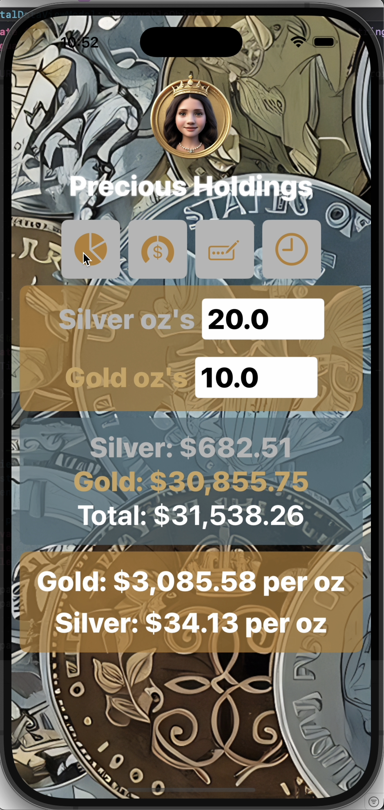

# Work in progress not 100% ready yet.
This is just an example of something I wanted for my own interest. Its not 100% ready yet.. but wanted to get something into github.
* We use an api to fetch the latest gold/silver spot prices. 
* The interface allows a user to enter the amount of gold and/or silver they own. 
* The code then totals the holdings and displays as applicable.
* We create a pie chart to show percentages... obviously not quite there at the moment.
* Sections can be switched on and off with the buttons.
* Images are mine coins and my daughter.

## Video demo

## Image if video doesnt work

